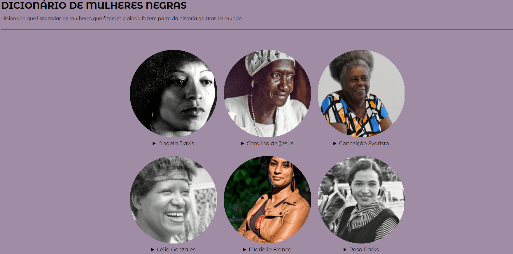

# Curso EuProgrAmo Front-End#2 [Turma 2] - Programaria [DEMO](https://sabrinagomesb.github.io/programaria-frontend2/)
## 📖 Sobre

Dividido em 8 MÓDULOS com o total de 78 aulas, o curso aborda os seguintes tópicos:

- [x] Apresentando novas tags HTML;
- [x] CSS e layouts responsivos;
- [x] Aprofundando os conhecimentos em JavaScript;
- [x] Dinamizando o código com JavaScript;
- [x] Decolando o seu projeto (Git/GitHub).
 
 📌 Curso disponível no site [progra{m}aria](https://www.programaria.org/).

## 💡 Projeto

### Dicionário de Mulheres Negras
 → Exibe imagens e descrição de mulheres que fizeram e ainda fazem parte da história do Brasil e do mundo.

 → Alterações realizadas no projeto final: alteração no estilo e ordenação por ordem alfabética utilizando JavaScript.

  

## 💻 Feito com

Feito por <a href="https://github.com/sabrinagomesb">💫 Sabrina Gomes</a>
